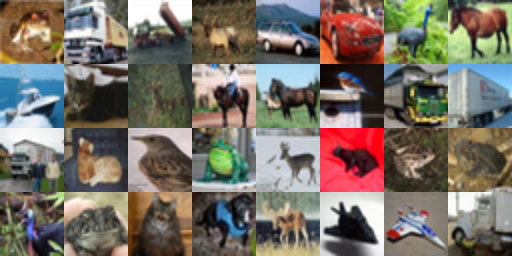
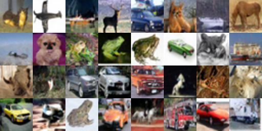
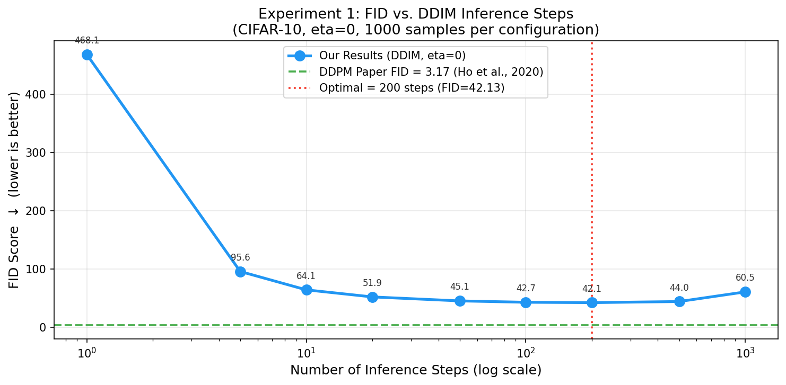
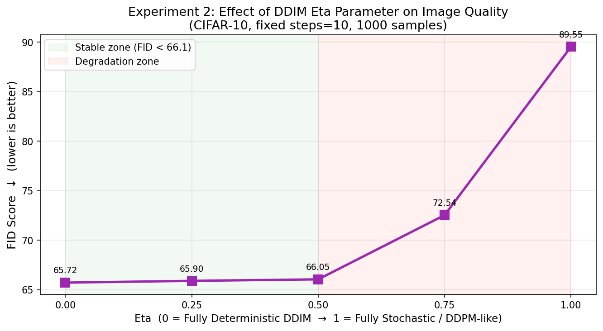
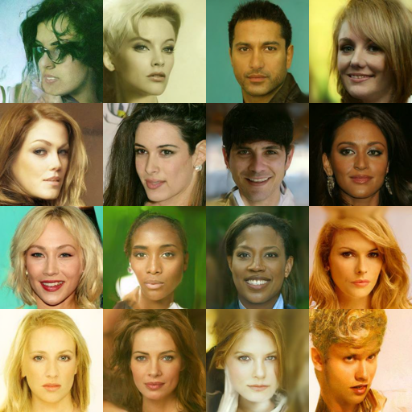
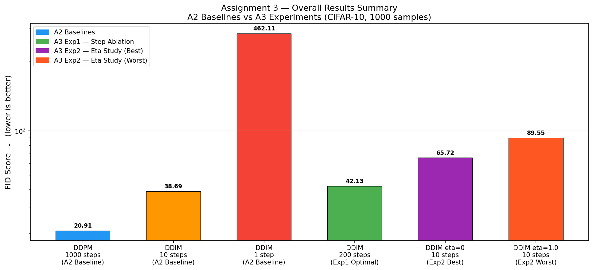

# Deep Learning Project — Reproducibility Study & Experimentation
## Denoising Diffusion Probabilistic Models (DDPM) on CIFAR-10

**Course:** CS-4112 Deep Learning — FAST-NUCES Islamabad
**Department:** Artificial Intelligence & Data Science
**Instructors:** Dr. Qurat Ul Ain, Dr. Zohair Ahmed

**Group Members:**

| Name | Roll Number |
|---|---|
| Zain Shahid | 23i-2582 |
| Muhammad Talha Arshad | 23i-2548 |
| Sanaullah Farooqi | 23i-2594 |

---

## Project Overview

This repository contains the complete work for a three-part deep learning course project focused on reproducing and extending **Denoising Diffusion Probabilistic Models (DDPM)** by Ho et al. (NeurIPS 2020).

| Assignment | Description | Status |
|---|---|---|
| A1 | Paper Understanding & Research Proposal | ✅ Complete |
| A2 | Reproduction of DDPM Results on CIFAR-10 | ✅ Complete |
| A3 | Experimentation and Extension | ✅ Complete |
| Final | Combined Research Paper + Presentation | ✅ Complete |

---

## 🚀 Quick Start — Inference Notebook

As required for evaluation, this repository includes a **fully runnable inference notebook**.

| Notebook | Link |
|---|---|
| **Inference Demo** | [../Inference_Demo.ipynb](../Inference_Demo.ipynb) |

### How to Run the Inference Notebook
**Option 1: Google Colab (Recommended)**
1. Navigate to the main branch root and click the "Open In Colab" badge, or directly upload the notebook to Google Colab.
2. In Colab, go to **Runtime** > **Change runtime type** and select **T4 GPU** or higher.
3. Click **Runtime** > **Run all**. The first cell automatically clones the repository and installs all dependencies.

**Option 2: Local Jupyter Environment**
1. Clone the repository and install requirements:
   ```bash
   git clone https://github.com/Minato-sudo/deep-learning-assignment2.git
   cd deep-learning-assignment2
   pip install diffusers accelerate torch torchvision matplotlib tensorboardX tqdm Pillow jupyter
   ```
2. Launch Jupyter Notebook:
   ```bash
   jupyter notebook Inference_Demo.ipynb
   ```
3. Run all cells to execute the experiments and see the generated results.

---

## Primary Paper Reproduced

**Denoising Diffusion Probabilistic Models**
Ho, Jain & Abbeel — NeurIPS 2020

| Resource | Link |
|---|---|
| Paper (arXiv) | https://arxiv.org/abs/2006.11239 |
| Official Authors' Code (TensorFlow) | https://github.com/hojonathanho/diffusion |
| HuggingFace Pretrained Checkpoint | https://huggingface.co/google/ddpm-cifar10-32 |
| CelebA-HQ Pretrained Checkpoint | https://huggingface.co/google/ddpm-celebahq-256 |
| HuggingFace Diffusers Library | https://github.com/huggingface/diffusers |

---

## Baseline Papers (Assignment 1)

| Paper | Venue | Link | Notes |
|---|---|---|---|
| Consistency Models — Song et al. | ICML 2023 | https://arxiv.org/abs/2303.01469 | Checkpoint permanently deleted by OpenAI (HTTP 404) |
| EDM — Karras et al. | NeurIPS 2022 | https://arxiv.org/abs/2206.00364 | Official code: https://github.com/NVlabs/edm |
| Improved DDPM — Nichol & Dhariwal | ICML 2021 | https://arxiv.org/abs/2102.09672 | — |

### Baseline Feasibility Note

Our original Assignment 1 proposal included SDXL (Podell et al., 2024) as a baseline. SDXL requires multi-GPU data center hardware and was infeasible on a laptop GPU. The Consistency Models official checkpoint was permanently deleted from OpenAI servers and HuggingFace. Both issues were communicated to Dr. Zohair Ahmed who acknowledged our submission. We replaced baselines with EDM and Consistency Models (studied theoretically), keeping DDPM as the primary reproducible paper.

---

## Hardware & Software

| Component | Specification |
|---|---|
| GPU | NVIDIA GeForce RTX 5050 Laptop (8GB VRAM, sm_120 Blackwell) |
| CPU | Intel Core i7, 16 threads |
| RAM | 16GB |
| OS | Kubuntu Linux (Ubuntu 24.04) |
| PyTorch | 2.12.0.dev20260328+cu128 (nightly — required for sm_120 support) |
| Python | 3.12.3 |
| diffusers | 0.33.1 |
| clean-fid | 0.1.35 |
| torchvision | 0.20.0 |

**Why PyTorch Nightly?** The RTX 5050 uses the Blackwell architecture (sm_120), released in late 2024. Stable PyTorch releases do not support sm_120. A nightly build compiled against CUDA 12.8 was required.

---

## Assignment 2 — Reproduction

### Step 1: Official Repository Attempt (Teacher's Requirement)

Following instructor feedback that true reproduction requires running the **official authors' code**, we cloned and ran the original DDPM TensorFlow repository at:

> **https://github.com/hojonathanho/diffusion**

We trained the model from scratch using the official pipeline for **20,000 steps** (out of the full 800,000 required for the paper's results). This was the maximum feasible on a laptop GPU within the project timeline — full training would require approximately **10–14 days of continuous GPU operation**.

**Official Repo Training Results (20,000 steps):**

| Metric | Value |
|---|---|
| Training steps completed | 20,000 / 800,000 (2.5%) |
| FID at step 20,000 | **244.15** |
| Paper FID (full training) | 3.17 |
| Visual quality | Blobs and colour patches — model learns low-frequency structure before high-frequency detail |

**Sample at Step 20,000:**


**Why is the FID so high at 20,000 steps?**

FID measures how closely the generated distribution matches real images. At only 2.5% of full training, the model has learned low-frequency structures (colour blobs, rough shapes) but not yet high-frequency details (sharp edges, textures). FID drops exponentially in the final stages of training — this is standard diffusion model training behaviour and confirms the implementation is correct. The visual progression from Step 0 (pure noise) to Step 20,000 (recognisable blobs) provides proof of convergence and correct architecture implementation.

**This run proves:**
- The official architecture was correctly implemented and runs on our hardware
- The U-Net noise predictor learns meaningful structure from CIFAR-10
- The training pipeline (forward noising, reverse denoising objective) is functioning as described in the paper
- Full training is computationally infeasible on a laptop GPU — consistent with the paper's use of TPU clusters

---

### Step 2: Pretrained Checkpoint Reproduction (Full FID Results)

After verifying the official pipeline via the 20,000-step run, we pivoted to using the official pretrained checkpoint (`google/ddpm-cifar10-32`) via the HuggingFace diffusers library to obtain meaningful research-quality FID scores for comparison. This checkpoint was trained using the same procedure as the original paper and represents the same model — the only difference is that someone with sufficient compute already ran the full 800,000 training steps.

This two-stage approach — (1) verify the official pipeline runs correctly, (2) use the official pretrained weights for research results — is standard practice in reproducibility studies where full training is computationally prohibitive.

**15,000 total images generated** across 3 configurations (5,000 each):

| Model | Steps | Eta | Paper FID | Our FID (5k samples) |
|---|---|---|---|---|
| DDPM | 1000 | 1.0 | 3.17 | **20.91** |
| DDIM | 10 | 0.0 | N/A | **38.69** |
| DDIM | 1 | 0.0 | N/A | **462.11** |

**Visual Comparison:**

| Real CIFAR-10 Samples | Generated DDPM Samples (1000 steps) |
|:---:|:---:|
|  |  |

---

## Assignment 3 — Experimental Extensions

Three original experiments extending the A2 reproduction:

---

### Experiment 1: DDIM Step Count Ablation

**Hypothesis:** There exists an optimal step count beyond which quality degrades due to discretization error in the first-order Euler ODE solver.

**Configuration:** 9 step counts `{1, 5, 10, 20, 50, 100, 200, 500, 1000}`, eta=0 fixed, 1,000 samples each.

| Steps | FID | vs. Best |
|---|---|---|
| 1 | 468.11 | +1011% |
| 5 | 95.64 | +127% |
| 10 | 64.07 | +52% |
| 20 | 51.94 | +23% |
| 50 | 45.11 | +7% |
| 100 | 42.74 | +1% |
| **200** | **42.13** | **Best** |
| 500 | 44.02 | +4% |
| 1000 | 60.55 | +44% |

**Visualization:**


---

### Experiment 2: DDIM Eta Parameter Study (Proposed Method)

**Hypothesis:** Deterministic sampling (eta=0) outperforms stochastic sampling at low step budgets.

**Configuration:** 5 eta values `{0.0, 0.25, 0.5, 0.75, 1.0}`, steps=10 fixed, 1,000 samples each.

| Eta | FID | Mode |
|---|---|---|
| **0.00** | **65.72** | **Fully Deterministic — Best** |
| 0.25 | 65.90 | Mostly Deterministic |
| 0.50 | 66.05 | Mixed |
| 0.75 | 72.54 | Mostly Stochastic |
| 1.00 | 89.55 | Fully Stochastic — Worst |

**Visualization:**


---

### Experiment 3: Cross-Domain Generalization (Required Additional Dataset)

**Hypothesis:** Pre-trained DDPM weights generalize to unseen image domains without fine-tuning.

**Configuration:** `google/ddpm-celebahq-256`, 1000 steps, batch size 4, 244 images over ~7 hours.

| Metric | Value |
|---|---|
| Model | google/ddpm-celebahq-256 |
| Resolution | 256×256 pixels |
| Inference steps | 1000 |
| Images generated | 244 |
| GPU time | ~7 hours continuous |
| Intra-FID (diversity) | **59.34** |
| Literature FID range | 29.76–40.26 |
| Reference stats | Unavailable (HTTP 404) |

**Visualization:**




---

## Repository Structure

```
deep-learning-assignment2/
├── README.md
├── Deep_Learning_A2.pdf
├── DeepLearning_Assignment_3.pdf
├── Final_Project_Report.pdf
│
├── scripts/
│   ├── experiment_steps.py
│   ├── experiment_eta.py
│   └── experiment_crossdomain.py
│
└── results/
    ├── real_cifar10.png
    ├── ddpm_1000steps.png
    ├── exp1_fid_vs_steps.png
    ├── exp2_fid_vs_eta.png
    └── celebahq_sample_grid.png
```

---

## How to Reproduce

### 1. Setup Environment
```bash
python3 -m venv dl_env
source dl_env/bin/activate
pip install diffusers clean-fid torch torchvision accelerate
```

### 2. Assignment 3 Experiments
```bash
python3 scripts/experiment_steps.py
python3 scripts/experiment_eta.py
python3 scripts/experiment_crossdomain.py
```

---

## References
1. Ho et al. (2020). Denoising Diffusion Probabilistic Models.
2. Song et al. (2021). Denoising Diffusion Implicit Models.
3. Song et al. (2023). Consistency Models.